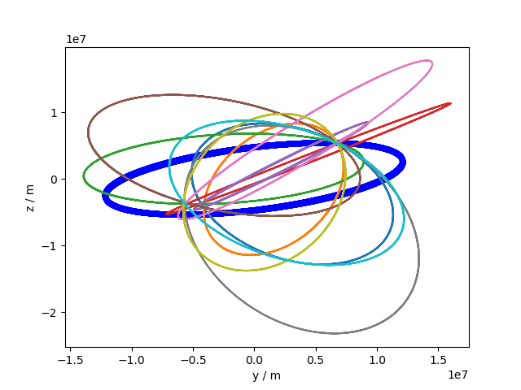
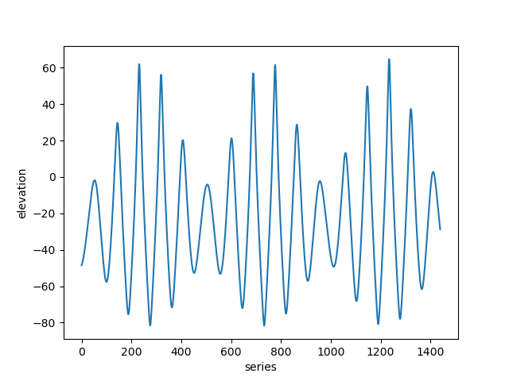

The code mainly provide simulation data for testing the initial Orbit Determination(IOD) algorithm, in both ground-based and space-based telescope cases

The code relies heavily on three python libraries commonly used in astronomy

## 1.orekit

Orekit, a low level space dynamics library written in Java, has gained widespread recognition since it was released under an open source license in 2008.

Orekit aims at providing accurate and efficient low level components for the development of flight dynamics applications. It is designed to be easily used in very different contexts, from quick studies up to critical operations. As a library, Orekit provides basic elements and various algorithms to handle them.

###  install

`conda install -c conda-forge orekit`

## 2.poliastro

poliastro is an open source pure Python library for interactive Astrodynamics and Orbital Mechanics, with a focus on ease of use, speed, and quick visualization. It provides a simple and intuitive API, and handles physical quantities with units.

### install

`conda install -c conda-forge poliastro=0.15`\
`pip install poliastro`

## 3.astropy

The Astropy Project is a community effort to develop a common core package for Astronomy in Python and foster an ecosystem of interoperable astronomy packages.

### install

`conda install astropy`\
`pip install astropy`

Other libraries can be installed in case of 'ImportError' during use

# Usage

Fisrt, you should unzip 'orekit-data.zip', then run the following command to obtain two types of simulation data.

`python test.py`

From this command, you can get 4 `.npy` files and 4 result pictures, among which 3 files are the three-axis components of a satellite in the Cartesian coordinate system, The other is the 10 simulated orbits in the space-based environment, Two of the four resulting images reflect the 10 simulated orbits, and the other two reflect the elevation and azimuth of an orbit.

# Results

the simulation orbit in yz plane

the simulation orbie in 3D plot

elevation

azimuth

